# PB_SBC01_H3 — обзор

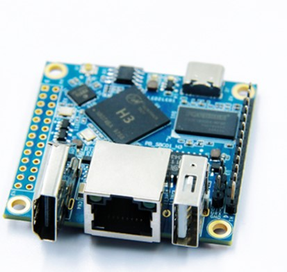 

**PB_SBC01_H3** — компактный одноплатный компьютер размером 50×50 мм на базе процессора **Allwinner H3** (4 ядра ARM Cortex-A7, до 1.2 ГГц). Плата разработана для работы с Linux-системами (Ubuntu, Debian) и подходит как для изучения Linux, так и для создания встраиваемых решений.

## Аппаратные характеристики
- **Процессор:** Allwinner H3, 4 ядра Cortex-A7, 1.2 ГГц.
- **Графика:** Mali400MP2, поддержка OpenGL ES 2.0.
- **Оперативная память:** 1 ГБ DDR3.
- **Флэш-память:** 2 МБ SPI NOR Flash для загрузчика.
- **Поддержка хранения данных:** карты TF (microSD) до 64 ГБ.
- **Сеть:** Ethernet 100 Мбит/с + встроенный Wi-Fi.
- **Видео:** HDMI-выход.
- **Аудио:** mini-Jack через модуль расширения.
- **Интерфейсы ввода/вывода:**  
  - 26-контактный GPIO (совместим с Raspberry Pi)
  - UART для отладки
  - SPI, I2C, дополнительные UART-интерфейсы через GPIO
  - Поддержка инфракрасного приёма (через расширение)
- **USB:** 3 × USB 2.0 через дополнительную плату.
- **Питание:** 5 В через разъём USB Type-C. 

## Поддерживаемые системы
Плата официально поддерживает образы на базе **Ubuntu 18.04**, **Ubuntu 20.04** и **Debian 10** с ядром Linux 5.4. Для установки используется стандартная запись образа `.img` на карту памяти через программы вроде `Win32DiskImager`.

## Работа с интерфейсами
Документация предоставляет подробные инструкции по:
- подключению по UART для отладки через консоль;
- настройке и проверке Ethernet и Wi-Fi;
- работе через SSH;
- тестированию GPIO, SPI, I2C и UART;
- подключению USB-устройств и камер;
- управлению встроенными светодиодами;
- использованию инфракрасного приёмника.

## Назначение
PB_SBC01_H3 можно использовать для:
- сборки лёгких серверов (например, Wi-Fi точки доступа);
- создания встраиваемых систем (управление 3D-принтером, робототехника, автоматизация);
- работы с мультимедиа (HDMI-вывод видео);
- обучения основам Linux, сетевого взаимодействия, работы с GPIO.

Также возможна компиляция собственного ядра и системы на базе предоставленного SDK.

## Особенности
- Небольшие размеры и вес.
- Минимальная нагрузка на питание — достаточно стандартного адаптера 5 В / 2 А через Type-C.
- Требует аккуратной работы с качественными картами памяти для стабильной загрузки.
- Для расширения возможностей необходима отдельная плата расширения USB и аудио.

## Выводы
**PB_SBC01_H3** — удобная плата для небольших Linux-проектов, обучения, а также для разработчиков, кому нужен недорогой, компактный вариант с базовыми возможностями вывода HDMI, работой с сетью и простыми периферийными устройствами. Подходит для задач, где важны малые размеры и открытая архитектура.

---

> Документация и инструкции по настройке доступны в комплекте поставки.

# Подробная инструкция для записи образов Armbian и начального управления GPIO через интернет

## Часть 1. Подготовка образа Armbian на microSD карту

### Что понадобится
- Образ Armbian (.img или .img.xz) для совместимой платы (например, Orange Pi PC на Allwinner H3).
- microSD карта минимум на 8–16 ГБ, желательно класс 10.
  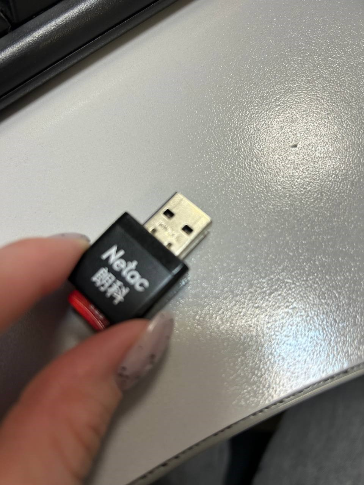
- Картридер для подключения карты к ПК.
  _CONNECT_THROUGH_USB-Adapter.jpg)
  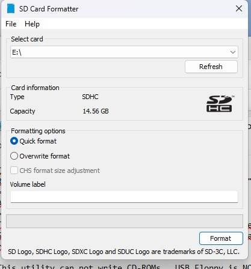
  
### Программы для записи образов
Осовные и использованные для этого теста:
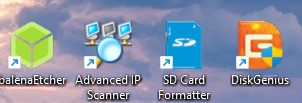
#### 1. Balena Etcher
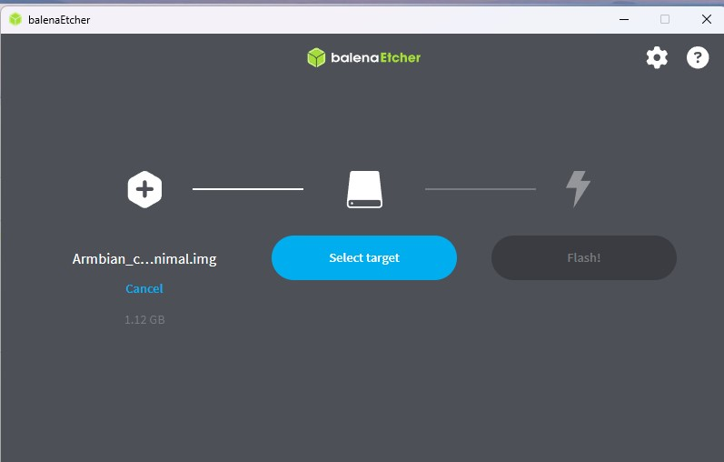
- Сайт: [https://www.balena.io/etcher/](https://www.balena.io/etcher/)
- Очень простая программа для записи .img файлов.
- Инструкция:
  1. Установить и запустить.
  2. Выбрать образ .img или .img.xz.
  3. Выбрать microSD карту.
  4. Нажать Flash.
После успешной загрузки образа Вы можете извлечь карту из USB-адаптера и вставить в разъём на плате.
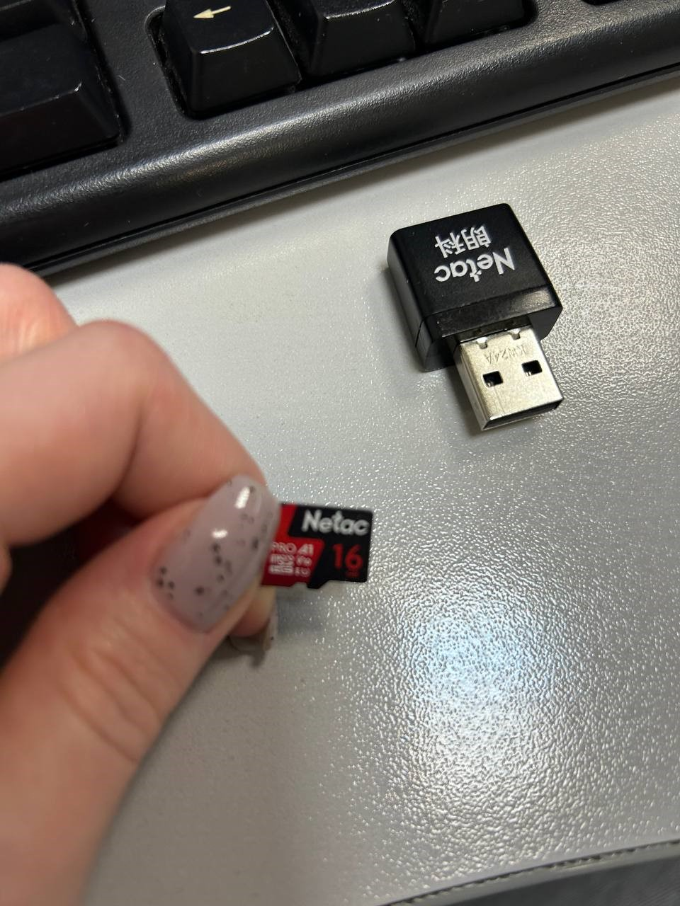
Затем подайте питание на плату и подождите загрузки системв (*это может занять  от 30 - 60 секунд*)
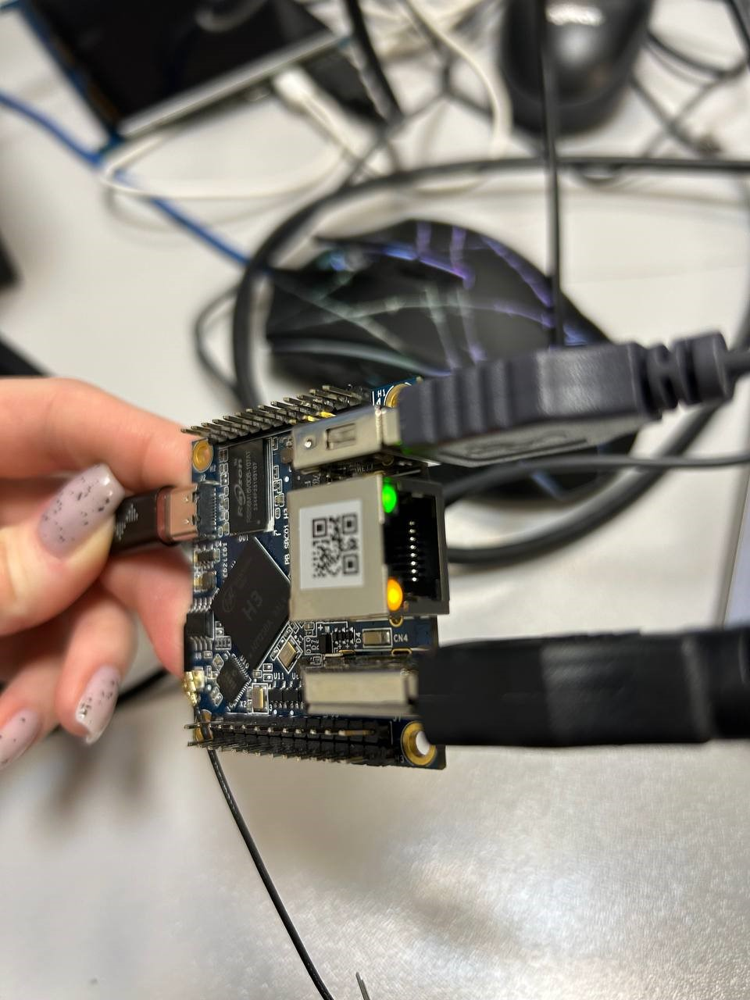
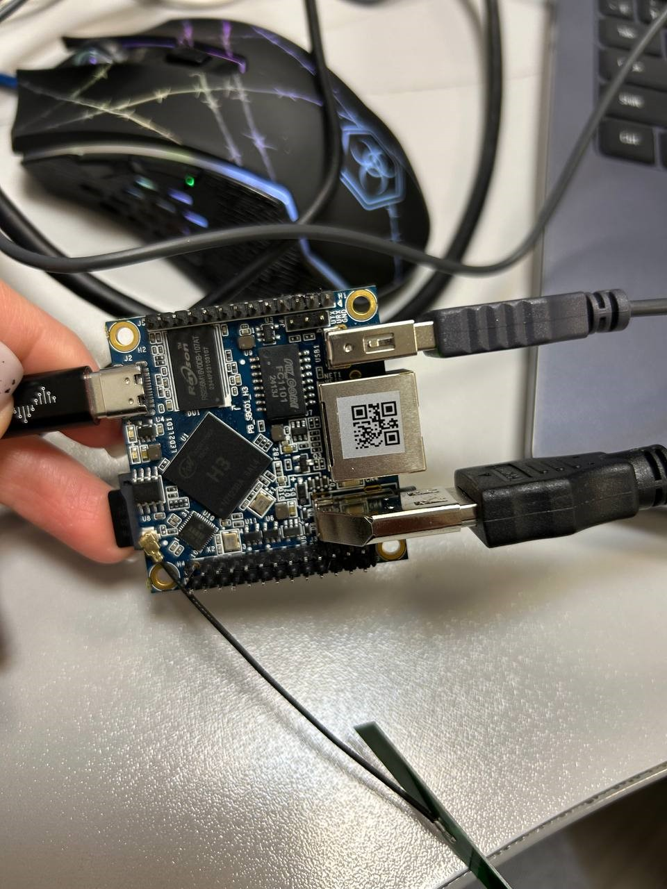
#### 2. Win32DiskImager
 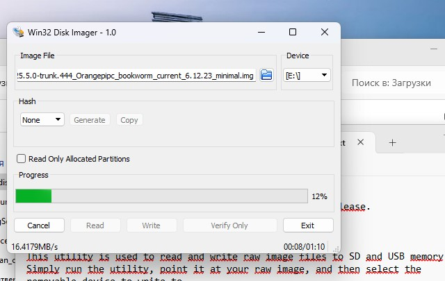
- Сайт: [https://sourceforge.net/projects/win32diskimager/](https://sourceforge.net/projects/win32diskimager/)
- Подходит для Windows. Прост в использовании.
- Инструкция:
  1. Запустить программу.
  2. Выбрать файл образа.
  3. Выбрать букву устройства для карты памяти.
  4. Нажать Write.

### Особенности работы с картой памяти после записи
- Windows может предложить "форматировать диск" — откажитесь.
- Если виден раздел boot, можно туда добавить настройки Wi-Fi (armbian_first_run.txt).
  
 ** Если плату не видно, то вы можете вручную задать мея сети и пароль, чтобы плата при первом включениисмогла сама найти сеть. Вы же увидите имя ( IP) в приложении Advanced IP Scanner:**
- Программа для добавления настроечного файля в boot для подключения к сети WI-FI
  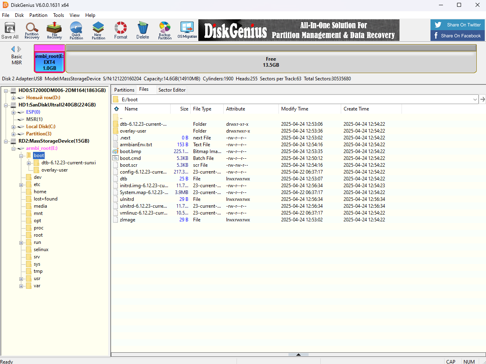
- Программа для сканирования устройств подключенных к сети
    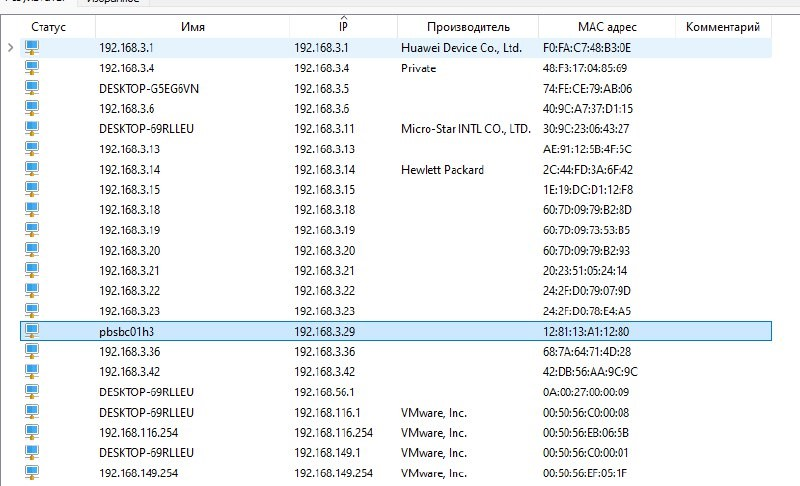
  
## Часть 2. Подключение платы к сети без монитора

Если нет доступа к HDMI или UART, можно заранее настроить Wi-Fi:

1. Создать текстовый файл armbian_first_run.txt.

Пример содержимого:
Ini


FIRST_LOGIN_USER_NAME=root
FIRST_LOGIN_USER_PASSWORD=1234
WIFI_NETWORK_NAME='Название_вашей_сети'
WIFI_NETWORK_PASSWORD='Пароль_от_WiFi'

2. Скопировать файл в раздел boot карты памяти перед первым запуском платы.
3. После старта плата подключится к Wi-Fi автоматически.

### 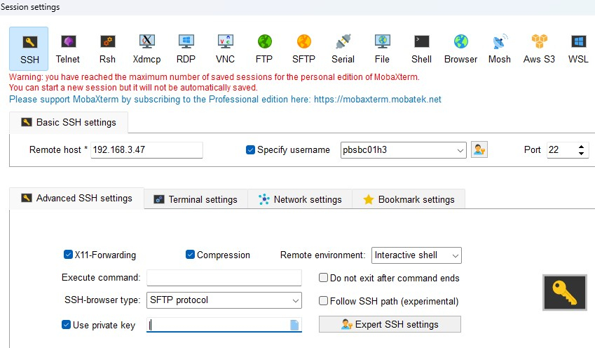
Подключиться можно и стандартным способом по SSH-соединению, если Вы уже имели опыт работы с платой и созранили базовые настройки подключения, либо согласно алгоритму прописанному в  нашей документации к плате, можно подключить вручную вводом имени и пароля.
Прописывать все те же команды в открывшемся терминале.

## Часть 3. Управление GPIO через интернет (через Flask веб-сервер)

### Требования
- Установленная ОС Armbian на плате.
- Рабочее подключение к сети.
- Установленный Python 3 и Flask:
''' Bash
sudo apt update
sudo apt install python3-flask -y

### Код сервера для управления светодиодом
Создайте файл gpio_web_control.py:

'''Python
from flask import Flask, render_template_string, request
import os

app = Flask(__name__)

GPIO = "15"  # Номер GPIO-пина
gpio_path = f"/sys/class/gpio/gpio{GPIO}/value"

# Инициализация GPIO
if not os.path.exists(f"/sys/class/gpio/gpio{GPIO}"):
    with open("/sys/class/gpio/export", "w") as f:
        f.write(GPIO)
with open(f"/sys/class/gpio/gpio{GPIO}/direction", "w") as f:
    f.write("out")

# HTML страница управления
HTML = '''
<!doctype html>
<title>GPIO Управление</title>
<h2>GPIO{{ pin }} — Управление</h2>
<form method="POST">
    <button name="state" value="1">Включить</button>
    <button name="state" value="0">Выключить</button>
</form>

Текущее состояние: {{ state }}

'''

@app.route("/", methods=["GET", "POST"])
def control():
    if request.method == "POST":
        state = request.form["state"]
        with open(gpio_path, "w") as f:
            f.write(state)
    with open(gpio_path, "r") as f:
        current = f.read().strip()
    return render_template_string(HTML, pin=GPIO, state=current)

if __name__ == "__main__":
    app.run(host="0.0.0.0", port=8080)

### Как запустить

'''Bash
sudo python3 gpio_web_control.py

После запуска откройте браузер на ПК и перейдите по адресу:
'''copy
http://<IP_платы>:8080

> Вы увидите страницу с кнопками для управления светодиодом через интернет, если вс Ваши шаги выполнены верно.
> На пуказанных изображениях приведена информаци по программ и взаимодействию с ними, а также альтернативные способы загрузки образа для первой прошивки. Стандартный способ есть у нас в документации на сайте или по запросу Вы можете ознакомиться с ним.

